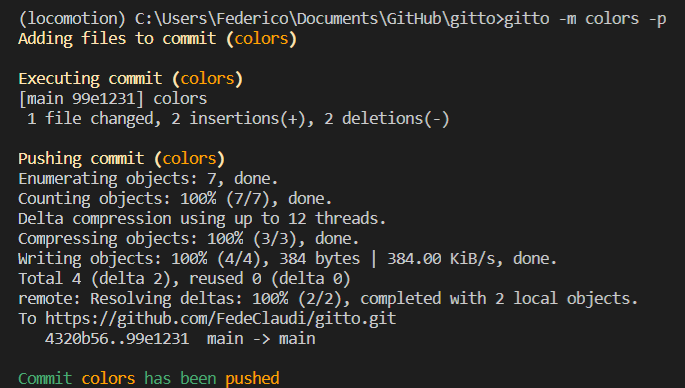

# gitto
Automate git commits.

A minuscle python package to automate:
```
git add .
git commit -m bump
git push
```

### Installation
```
pip install gitto
```

## Usage
From the command line, in a git repository:
```
gitto -m commit_name -f file1 file2 file3 -p
```

Both `-m` (commit message) and `-f` (committed files) are **optional**.
If `-m` is omitted the commit will be called "bump", if `-f` is omitted **all** changed files will be added to the commit. 

If `-p` is omitted, the commit will be staged but not pushed to the upstream branch.


The results might look something like:
<br>
</img>

That's it!